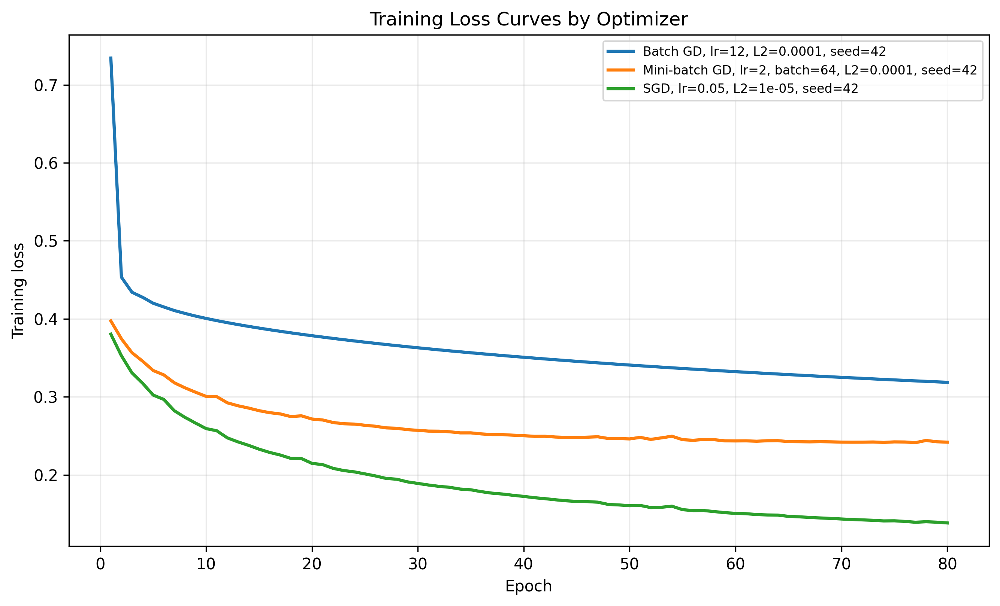
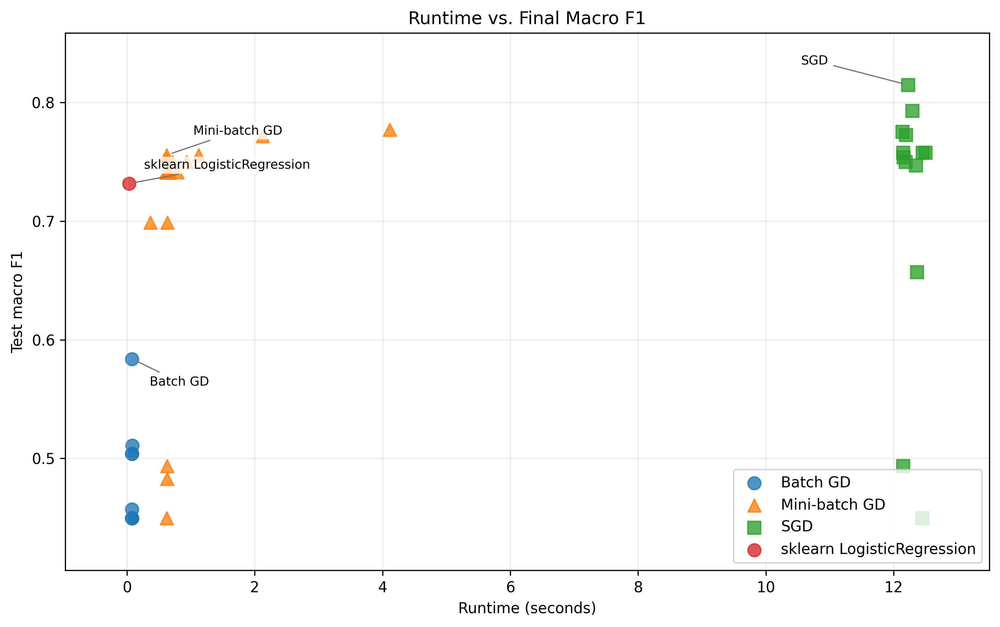
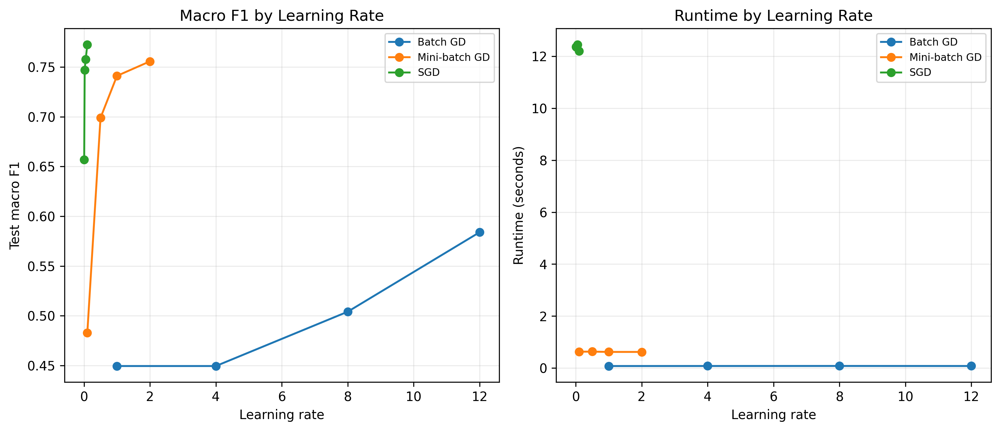
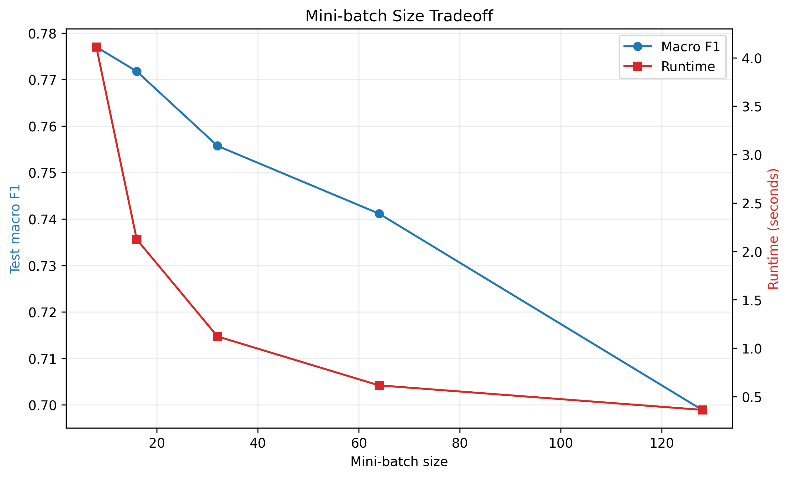
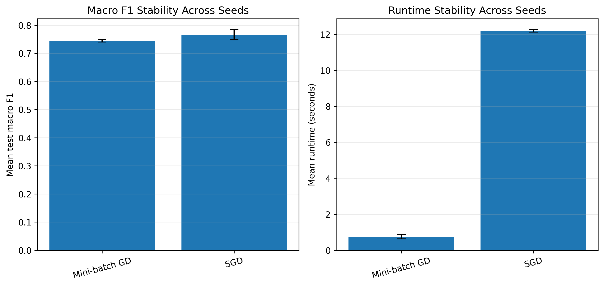
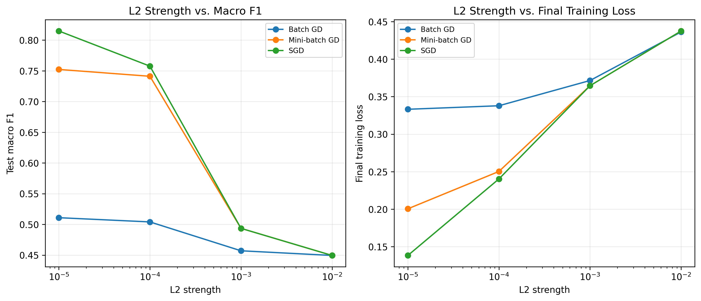

# Optimising Sentiment Analysis on Trump Truth Social Posts

## Research Question

How do Batch Gradient Descent, Stochastic Gradient Descent, and Mini-batch Gradient Descent compare when optimizing the same L2-regularized logistic regression objective for binary sentiment classification on Truth Social post text?

The project studies optimizer behavior while holding the modeling problem fixed: the same dataset, same text preprocessing, same TF-IDF feature representation, same binary logistic regression objective, same train/test split, and same evaluation metrics. The central question is not only which optimizer obtains the highest classification score, but which optimizer gives the best tradeoff between predictive performance, runtime, convergence behavior, and stability.

## Project Motivation

Sentiment classification is often presented as a machine learning task, but the learning process is fundamentally an optimization problem. Logistic regression learns its coefficients by minimizing a regularized loss function. Different gradient-based optimizers follow different paths through the loss surface, and those paths affect runtime, convergence smoothness, sensitivity to hyperparameters, and final classification performance.

This project uses a real text classification setting to make those optimization tradeoffs visible. The goal is to compare optimizers under controlled conditions rather than to build the most complex possible sentiment model. A simple linear classifier with sparse TF-IDF features is useful here because it keeps the objective interpretable while still producing a realistic high-dimensional optimization problem.

## Dataset Description

The text data comes from scraped Factbase pages containing Donald Trump Truth Social posts. The scraping script stores post metadata and text in `data/raw/factbase_truthsocial_texts.csv`, and subsequent preprocessing creates cleaner modeling files.

Important dataset artifacts:

| File | Purpose |
| --- | --- |
| `data/raw/factbase_truthsocial_texts.csv` | Raw scraped post records from Factbase. |
| `data/processed/factbase_truthsocial_texts_clean.csv` | Cleaned post-level dataset with parsed dates, URLs, text lengths, word counts, and duplicate flags. |
| `data/processed/factbase_truthsocial_texts_nlp_ready.csv` | Normalized text prepared for NLP feature extraction. |
| `data/processed/factbase_truthsocial_texts_sentiment_labeled.csv` | Final labeled dataset used by the logistic regression experiments. |

The saved TF-IDF configuration reports 7,437 documents and 5,000 extracted features. The labeled sentiment dataset contains 7,437 rows, with 6,070 positive labels and 1,367 negative labels. The modeling split used 5,949 training rows and 1,488 test rows with a 20 percent stratified test split and random state 42.

## Sentiment Labeling Setup

Sentiment labels are generated automatically using NLTK's VADER `SentimentIntensityAnalyzer` in `label_sentiment_dataset.py`. For each text, VADER produces negative, neutral, positive, and compound sentiment scores. The binary label is assigned from the compound score:

```text
positive if compound >= 0
negative otherwise
```

The generated labels should be interpreted as bootstrap sentiment labels rather than manually verified ground truth. This is an important limitation, but it is acceptable for this project because the main focus is optimizer behavior under a fixed supervised learning setup.

Saved labeling summary:

| Label | Count |
| --- | ---: |
| positive | 6,070 |
| negative | 1,367 |

## Preprocessing Pipeline

The project follows a staged preprocessing pipeline:

1. `scrape_factbase.py` scrapes Factbase Truth Social post cards and saves raw text, dates, post URLs, and raw card text.
2. The cleaning stage produces `data/processed/factbase_truthsocial_texts_clean.csv`, including standardized text fields, parsed dates, text length, word count, and duplicate text flags.
3. `prepare_tfidf_dataset.py` normalizes text for NLP by lowercasing, replacing URLs with `url`, replacing mentions with `user`, decoding `&amp;`, removing non-word characters, collapsing underscores, and normalizing whitespace.
4. `label_sentiment_dataset.py` assigns VADER-based binary sentiment labels.
5. The optimizer scripts train and evaluate logistic regression models using the normalized `text_for_nlp` column.

The preprocessing keeps the optimization experiment controlled: all optimizers receive the same sparse feature matrix and the same target labels.

## Feature Representation Using TF-IDF

Text is represented using `TfidfVectorizer` with the following saved configuration:

| Setting | Value |
| --- | --- |
| n-gram range | unigrams and bigrams |
| `min_df` | 2 |
| `max_df` | 0.98 |
| maximum features | 5,000 |
| term frequency scaling | sublinear TF |
| normalization | L2 |
| lowercase inside vectorizer | false, because text is already normalized |

The resulting TF-IDF matrix is sparse and high-dimensional. This makes it a natural setting for gradient-based optimization because each model parameter corresponds to a token or phrase feature.

## Logistic Regression Model

The classifier is binary logistic regression with L2 regularization. Let:

- $X \in \mathbb{R}^{n \times d}$ be the TF-IDF feature matrix, where each row $x_i$ represents one post.
- $y \in \{0,1\}^n$ be the binary sentiment labels, with 1 representing positive sentiment and 0 representing negative sentiment.
- $w \in \mathbb{R}^d$ be the logistic regression parameter vector.
- $b \in \mathbb{R}$ be the bias term.
- $\lambda \ge 0$ be the L2 regularization strength.

For each example, the model computes:

$$
p_i = \sigma(w^T x_i + b) = \frac{1}{1 + e^{-(w^T x_i + b)}}
$$

The optimization objective is binary cross-entropy with L2 regularization:

$$
\begin{aligned}
J(w,b) =
&-\frac{1}{n}\sum_{i=1}^{n}
\left[
y_i \log(p_i) + (1-y_i)\log(1-p_i)
\right] \\
&+ \frac{\lambda}{2}\lVert w\rVert_2^2
\end{aligned}
$$

The corresponding full-training-set gradients are:

$$
\nabla_w J =
\frac{1}{n}X^T(p-y) + \lambda w
$$

$$
\nabla_b J =
\frac{1}{n}\sum_{i=1}^{n}(p_i-y_i)
$$

The bias term is not regularized. The custom optimizer implementation is in `train_custom_optimizers.py`, and the larger optimizer tradeoff experiments are in `optimizer_tradeoff_experiments.py`.

A scikit-learn reference model is also included in the validation-based experiment pipeline using `LogisticRegression(penalty="l2", solver="lbfgs")`. This model is used as a sanity-check implementation to verify that the custom optimizers are learning reasonable parameter values on the same TF-IDF split. It is not the main project contribution and does not replace the custom Batch GD, SGD, and Mini-batch GD comparison.

## Why This Is an Optimisation Project

The core of the project is the comparison of optimization algorithms on the same objective function. The logistic regression model is intentionally simple so that the optimizer behavior can be isolated and studied directly.

The optimization elements include:

- a clearly defined loss function;
- L2 regularization strength as part of the objective;
- three gradient-based optimization methods;
- learning-rate sensitivity experiments;
- mini-batch-size experiments;
- regularization interaction experiments;
- seed stability experiments;
- convergence tracking using epoch-level loss histories;
- runtime and loss-smoothness comparisons.

The project therefore evaluates how different update rules affect the process of minimizing the same empirical risk.

## Optimizers Compared

### Batch Gradient Descent

Batch Gradient Descent computes the gradient using the full training set before each parameter update. It has a deterministic update direction for a fixed dataset and parameter state.

For learning rate $\eta$, each epoch applies:

$$
w \leftarrow w - \eta \nabla_w J
$$

$$
b \leftarrow b - \eta \nabla_b J
$$

where both gradients are computed over the full training set.

Advantages:

- smoothest conceptual estimate of the true empirical gradient;
- low implementation complexity;
- predictable loss trajectory when the learning rate is well chosen.

Tradeoffs:

- each update uses the entire training set;
- can improve slowly in terms of useful progress per epoch;
- in the saved experiments it produced weaker classification performance than SGD and Mini-batch GD.

### Stochastic Gradient Descent

Stochastic Gradient Descent updates the weights after each individual training example. The order of examples is randomized by seed.

For a single example $(x_i, y_i)$, the stochastic gradients are:

$$
\nabla_w J_i = (p_i-y_i)x_i + \lambda w
$$

$$
\nabla_b J_i = p_i-y_i
$$

The parameters are updated immediately after each example:

$$
w \leftarrow w - \eta \nabla_w J_i
$$

$$
b \leftarrow b - \eta \nabla_b J_i
$$

Advantages:

- frequent parameter updates;
- can move quickly toward useful regions of the parameter space;
- achieved the best single macro F1 result in the saved experiments.

Tradeoffs:

- noisier update path;
- slower wall-clock runtime in this implementation;
- more sensitive to seed and learning-rate choices.

### Mini-batch Gradient Descent

Mini-batch Gradient Descent computes gradients on small batches of examples. It is a compromise between the stable full-batch gradient and the noisy single-example SGD update.

For a mini-batch $B$ with $|B|$ examples, the gradients are:

$$
\nabla_w J_B =
\frac{1}{|B|}\sum_{i \in B}(p_i-y_i)x_i + \lambda w
$$

$$
\nabla_b J_B =
\frac{1}{|B|}\sum_{i \in B}(p_i-y_i)
$$

The update is:

$$
w \leftarrow w - \eta \nabla_w J_B
$$

$$
b \leftarrow b - \eta \nabla_b J_B
$$

Advantages:

- more stable than pure SGD;
- much faster than SGD in the saved runs;
- strong practical tradeoff between macro F1, runtime, and smoothness;
- best overall practical score in the generated analysis.

Tradeoffs:

- requires choosing a batch size;
- performance changes with both learning rate and batch size;
- may not always achieve the single highest macro F1.

### Optimizer Differences

| Optimizer | Update frequency | Runtime behavior | Convergence noise | Stability | Suitability for sparse TF-IDF |
| --- | --- | --- | --- | --- | --- |
| Batch GD | Once per epoch using all training examples. | Few updates, but each update uses the full dataset. In these runs it was fastest but least accurate. | Smoothest in principle because gradients use all examples. | Stable for suitable learning rates, but can progress slowly. | Works with sparse matrices, but full-dataset gradients may be less responsive. |
| SGD | After every single training example. | Many updates per epoch; slower in this implementation. | Noisiest path because each update uses one example. | More sensitive to seed and learning rate. | Well suited to sparse TF-IDF because each example activates only a small subset of features. |
| Mini-batch GD | After each mini-batch. | Balances update frequency and vectorized computation. | Less noisy than SGD, more responsive than Batch GD. | Strong practical stability in the saved experiments. | Very suitable: preserves sparse computation while using enough examples for reliable gradient estimates. |

## Experiment Grid

The main optimizer experiment file is `optimizer_tradeoff_experiments.py`. The validation-based pipeline uses a stratified 60/20/20 split with random seed 42:

| Split | Rows | Purpose |
| --- | ---: | --- |
| Train | 4,461 | Fit custom optimizers and the sklearn reference model. |
| Validation | 1,488 | Select optimizer and hyperparameter settings. |
| Test | 1,488 | Final held-out evaluation after selection. |

The saved validation report records 80 epochs per custom optimizer run, convergence tolerance `1e-4`, convergence patience 5, and 5,000 TF-IDF features. The test set is not used to choose learning rates, batch sizes, L2 values, seeds, or optimizers.

The saved experiment scenarios are:

| Scenario | Description |
| --- | --- |
| `learning_rate_sensitivity` | Compares optimizer-specific learning-rate values. |
| `mini_batch_size` | Compares Mini-batch GD batch sizes 8, 16, 32, 64, and 128. |
| `stability_across_seeds` | Compares SGD and Mini-batch GD across seeds 1, 7, 42, 99, and 123. |
| `l2_interaction` | Compares optimizer behavior across L2 values 0.00001, 0.0001, 0.001, and 0.01. |

Learning-rate values used in the sensitivity scenario:

| Optimizer | Learning rates |
| --- | --- |
| Batch GD | 1.0, 4.0, 8.0, 12.0 |
| SGD | 0.005, 0.02, 0.05, 0.1 |
| Mini-batch GD | 0.1, 0.5, 1.0, 2.0 |

The saved validation comparison contains 39 custom optimizer runs plus one sklearn reference row in `outputs/optimizers/validation/validation_optimizer_results.csv`. Selected custom configurations are written to `outputs/optimizers/validation/selected_optimizer_configs.csv`, and the final held-out comparison is written to `outputs/optimizers/validation/final_test_optimizer_results.csv`.

## Evaluation Metrics

The project evaluates both classification quality and optimization behavior.

| Metric | Role in the project |
| --- | --- |
| accuracy | Overall proportion of correctly classified test examples. |
| macro F1 | Average F1 across classes, giving equal weight to positive and negative classes. This is important because the dataset is label-imbalanced. |
| weighted F1 | F1 averaged by class support, reflecting performance under the observed class distribution. |
| runtime | Wall-clock training time for each optimizer configuration. |
| final loss | Final regularized training loss after the saved number of epochs. |
| convergence behavior | Loss path characteristics, including roughness, best loss epoch, convergence epoch, and epoch to 90 percent loss reduction. |

Validation metrics are used for model and hyperparameter selection. Test metrics are reported only for the selected custom optimizer configurations and the sklearn reference baseline. For sklearn LogisticRegression, the binary cross-entropy plus L2 objective is computed manually from the learned coefficients and intercept so its loss is comparable to the custom optimizer objective.

## Main Findings

The validation-based outputs are generated by `optimizer_tradeoff_experiments.py`. The important files are `outputs/optimizers/validation/validation_optimizer_results.csv`, `outputs/optimizers/validation/selected_optimizer_configs.csv`, `outputs/optimizers/validation/final_test_optimizer_results.csv`, and `outputs/optimizers/validation/validation_optimizer_report.json`.

### Selected Configurations

The custom optimizer settings are selected using validation macro F1, with runtime and validation loss as tie-breakers.

| Optimizer | Selected learning rate | Batch size | L2 value | Validation macro F1 | Validation accuracy | Validation weighted F1 | Runtime (s) | Final validation loss |
| --- | ---: | ---: | ---: | ---: | ---: | ---: | ---: | ---: |
| Batch GD | 12.0 |  | 0.0001 | 0.5839 | 0.8407 | 0.7909 | 0.0810 | 0.3391 |
| Mini-batch GD | 1.0 | 8 | 0.0001 | 0.7770 | 0.8891 | 0.8771 | 5.2027 | 0.3111 |
| SGD | 0.05 |  | 0.00001 | 0.8149 | 0.9032 | 0.8958 | 15.5580 | 0.2406 |

SGD with learning rate 0.05 and L2 value 0.00001 is selected as the best overall custom optimizer by validation macro F1.

### Final Held-Out Test Comparison

The held-out test set is evaluated only after the custom optimizer settings are selected. sklearn LogisticRegression is included as a reference baseline in the same final table.

| Optimizer | Selected learning rate | Batch size | L2 value | Validation macro F1 | Test macro F1 | Test accuracy | Test weighted F1 | Runtime (s) | Final training loss |
| --- | ---: | ---: | ---: | ---: | ---: | ---: | ---: | ---: | ---: |
| SGD | 0.05 |  | 0.00001 | 0.8149 | 0.7967 | 0.8931 | 0.8851 | 15.6554 | 0.1383 |
| Batch GD | 12.0 |  | 0.0001 | 0.5839 | 0.5632 | 0.8360 | 0.7813 | 0.0803 | 0.3186 |
| Mini-batch GD | 1.0 | 8 | 0.0001 | 0.7770 | 0.7854 | 0.8905 | 0.8803 | 5.0038 | 0.2394 |
| sklearn LogisticRegression |  |  | 0.0001 | 0.7309 | 0.7251 | 0.8710 | 0.8516 | 0.0960 | 0.2558 |

The sklearn model provides a useful sanity check: it trains quickly and lands in the same broad performance range as the custom optimizers. The strongest final test macro F1 among the selected custom optimizers is still produced by SGD, while Mini-batch GD remains a strong practical compromise with much lower runtime than SGD and substantially better classification performance than Batch GD.

### Seed Stability

The seed-stability scenario reruns SGD and Mini-batch GD across seeds 1, 7, 42, 99, and 123. The summary is saved to `outputs/optimizers/validation/optimizer_seed_stability_summary.csv`, and a compact dot plot with individual seeds plus mean and 95% confidence interval is saved to `outputs/optimizers/validation/figures/seed_stability_boxplot.png`.

| Optimizer | Seeds | Mean accuracy | Mean macro F1 | 95% CI macro F1 | Mean weighted F1 | Mean runtime (s) | Mean final loss |
| --- | ---: | ---: | ---: | --- | ---: | ---: | ---: |
| SGD | 5 | 0.8867 +/- 0.0044 | 0.7659 +/- 0.0180 | [0.7502, 0.7817] | 0.8724 +/- 0.0079 | 15.7470 +/- 0.0847 | 0.2403 +/- 0.0005 |
| Mini-batch GD | 5 | 0.8805 +/- 0.0012 | 0.7450 +/- 0.0046 | [0.7410, 0.7491] | 0.8627 +/- 0.0021 | 0.7269 +/- 0.0102 | 0.2502 +/- 0.0003 |

### Generated Figures

The analysis script generates several visual summaries:













An animated loss visualization is also saved as `outputs/optimizers/analysis/optimizer_loss_animation.gif`.

## Reproducibility Instructions

The project is organized so scraping is optional. The raw scraped CSV can be saved once and reused for preprocessing, labeling, training, and analysis.

Install the required Python packages inside the project environment first:

```bash
python -m pip install -r requirements.txt
```

If running the scraper, also install the Playwright browser once:

```bash
python -m playwright install chromium
```

To run everything from the scraper:

```bash
python run_pipeline.py --from-scrape
```

To skip scraping and start from the already saved raw CSV at `data/raw/factbase_truthsocial_texts.csv`:

```bash
python run_pipeline.py --from-saved-data
```

The first command runs browser-based scraping, then moves the scraped CSV into `data/raw/` and runs the full modeling pipeline. The second command starts from the saved scrape and reruns only cleaning, preprocessing, sentiment labeling, model training, optimizer experiments, and analysis.

Expected key outputs:

| Command | Main outputs |
| --- | --- |
| `clean_factbase_dataset.py` | `data/processed/factbase_truthsocial_texts_clean.csv` |
| `prepare_tfidf_dataset.py` | `data/processed/factbase_truthsocial_texts_nlp_ready.csv`, `data/features/factbase_truthsocial_texts_tfidf.npz`, `data/features/factbase_truthsocial_texts_tfidf_features.csv`, `data/features/factbase_truthsocial_tfidf_vectorizer.joblib`, `data/features/factbase_truthsocial_tfidf_config.json` |
| `label_sentiment_dataset.py` | `data/processed/factbase_truthsocial_texts_sentiment_labeled.csv`, `data/processed/factbase_truthsocial_texts_sentiment_label_summary.json` |
| `train_sentiment_logreg.py` | `models/sentiment_logreg_pipeline.joblib`, `outputs/classification/sentiment_logreg_report.json`, `outputs/classification/sentiment_logreg_test_predictions.csv` |
| `train_custom_optimizers.py` | `outputs/optimizers/baseline/optimizer_results.csv`, `outputs/optimizers/baseline/optimizer_loss_history.csv`, `outputs/optimizers/baseline/optimizer_report.json`, `outputs/optimizers/baseline/optimizer_test_predictions.csv`, `outputs/optimizers/baseline/optimizer_loss_curves.png` |
| `optimizer_tradeoff_experiments.py` | validation and final test artifacts in `outputs/optimizers/validation/`, plus `outputs/optimizers/validation/figures/seed_stability_boxplot.png` |
| `analyze_optimizer_tradeoffs.py` | Summary CSV/Markdown files and figures in `outputs/optimizers/analysis/` |

The scraping step is handled separately because it depends on browser automation and the current structure of the Factbase website. The saved data files allow the optimization experiments to be reproduced without scraping again.

## Limitations

- Sentiment labels are generated automatically using VADER, so some labels may be noisy, subjective, or mismatched with the intended political meaning of a post.
- Binary sentiment simplifies a more complex language task; many posts may contain mixed tone, rhetorical framing, or context that does not fit cleanly into positive or negative classes.
- TF-IDF creates sparse linear features and ignores deeper context, sarcasm, word order, and sequence meaning.
- Runtime depends on machine hardware, sparse-matrix implementation details, and local system load, so runtime should be interpreted comparatively within this project.
- Optimizer results depend on the searched learning rates, batch sizes, regularization values, and number of epochs.
- sklearn LogisticRegression is used only as a reference baseline; the main contribution is the comparison of custom Batch GD, SGD, and Mini-batch GD optimization methods.
- The results are specific to this dataset and should not be generalized to all political text or all sentiment classification tasks.

## Repository Structure

```text
.
|-- README.md
|-- run_pipeline.py
|-- scrape_factbase.py
|-- clean_factbase_dataset.py
|-- prepare_tfidf_dataset.py
|-- label_sentiment_dataset.py
|-- train_sentiment_logreg.py
|-- train_custom_optimizers.py
|-- optimizer_tradeoff_experiments.py
|-- analyze_optimizer_tradeoffs.py
|-- notebooks/
|   `-- data_cleaning.ipynb
|-- data/
|   |-- raw/
|   |   `-- factbase_truthsocial_texts.csv
|   |-- processed/
|   |   |-- factbase_truthsocial_texts_clean.csv
|   |   |-- factbase_truthsocial_texts_nlp_ready.csv
|   |   |-- factbase_truthsocial_texts_sentiment_labeled.csv
|   |   `-- factbase_truthsocial_texts_sentiment_label_summary.json
|   `-- features/
|       |-- factbase_truthsocial_texts_tfidf.npz
|       |-- factbase_truthsocial_texts_tfidf_features.csv
|       |-- factbase_truthsocial_tfidf_vectorizer.joblib
|       `-- factbase_truthsocial_tfidf_config.json
|-- models/
|   `-- sentiment_logreg_pipeline.joblib
`-- outputs/
    |-- classification/
    |   |-- sentiment_logreg_report.json
    |   `-- sentiment_logreg_test_predictions.csv
    `-- optimizers/
        |-- baseline/
        |-- tradeoff/
        |-- validation/
        |   `-- figures/
        `-- analysis/
```

## Conclusion

For this fixed TF-IDF logistic regression sentiment task, the validation-based pipeline selects SGD as the best custom optimizer by validation macro F1, and it also achieves the strongest held-out test macro F1 among the selected custom configurations. Mini-batch Gradient Descent remains a strong practical compromise because it gives similar test performance with much lower runtime than SGD. Batch Gradient Descent is fastest in wall-clock runtime but underperforms on classification quality. sklearn LogisticRegression is included as a reference implementation only; the project remains focused on the behavior of the custom optimizers.
